# Exchange de Criptomoedas

Este repositório tem como objetivo demonstrar minhas habilidades técnicas e detalhar as tecnologias e processos envolvidos na criação da exchange de Criptomoedas <a href="https://nossbit.com.br" target="_blank">nossbit.com.br</a>. Devido à natureza corporativa do projeto, o código-fonte não pode ser compartilhado. No entanto, a documentação aqui presente oferece uma visão abrangente das funcionalidades do sistema, acompanhada de explicações detalhadas e ilustrações.

## Página de Negociação

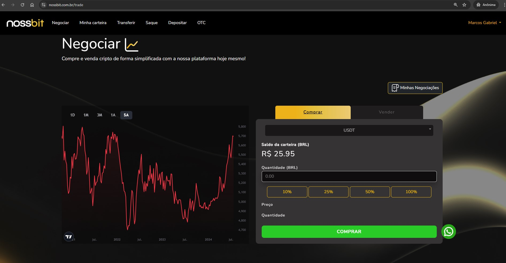

A **Página de Negociação** é o núcleo do site, onde os usuários podem comprar ou vender criptomoedas. As principais funcionalidades incluem:

- **Seleção de Criptomoedas**: Os usuários podem escolher entre diversas criptomoedas disponíveis. Ao selecionar uma moeda, o sistema realiza uma requisição para consultar o saldo do usuário nessa moeda específica e exibe a cotação atual.

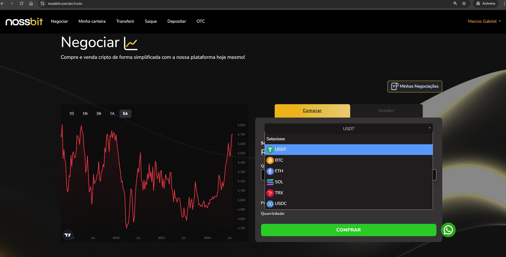

- **Atualização de Cotação e Cálculo de Transação**: Ao inserir o valor desejado para compra ou venda, o sistema faz uma chamada para calcular o montante correspondente baseado na cotação atual, retornando o valor que será transacionado.

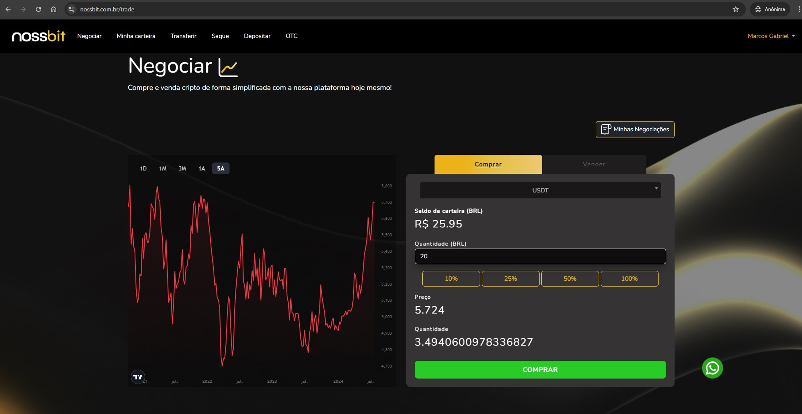

## Página da Carteira

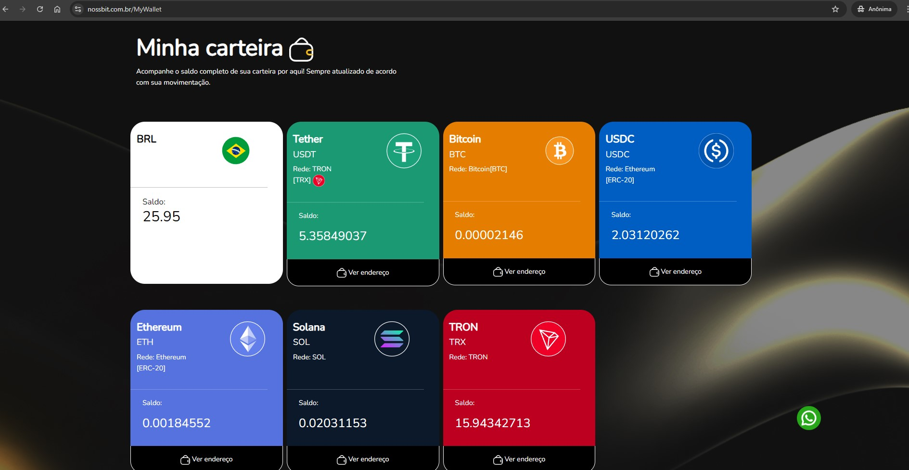

A **Página da Carteira** permite aos usuários visualizar seus saldos em diversas criptomoedas:

- **Consulta de Saldo**: O sistema realiza uma requisição para obter o saldo total de cada moeda.
- **Detalhamento e Geração de QR Code**: Ao clicar para visualizar detalhes, o endereço da carteira é exibido, juntamente com um QR Code gerado automaticamente para facilitar o processo de transações.

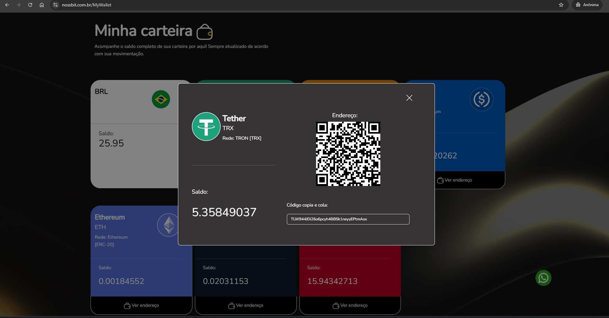

## Página de Saque

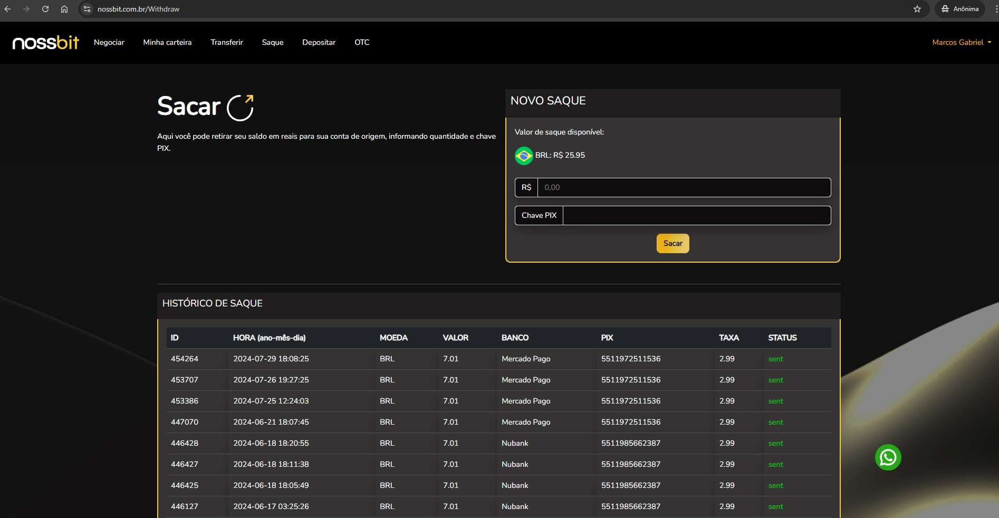

Na **Página de Saque**, os usuários podem retirar fundos de suas contas:

- **Processo de Saque**: Os usuários inserem o valor desejado para saque, e o sistema exibe o valor da taxa de transação.
- **Confirmação de Segurança**: Para finalizar a operação, é solicitado um código de confirmação enviado por e-mail.

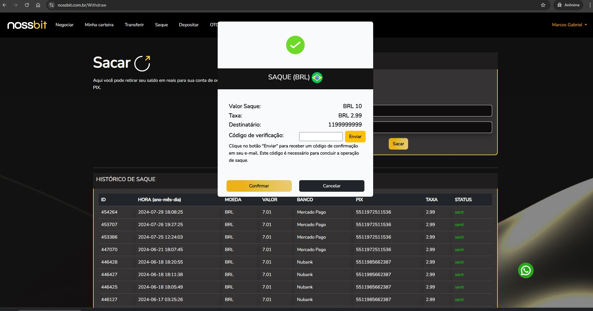

## Página Depositar

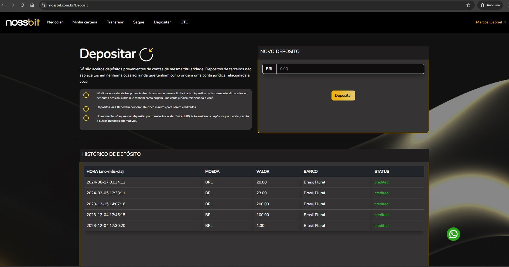

A **Página Depositar** permite aos usuários adicionar fundos às suas contas:

- **Geração de Pix QR Code**: Ao inserir o valor a ser depositado, um QR Code é gerado automaticamente via PHP, facilitando o pagamento através de Pix.

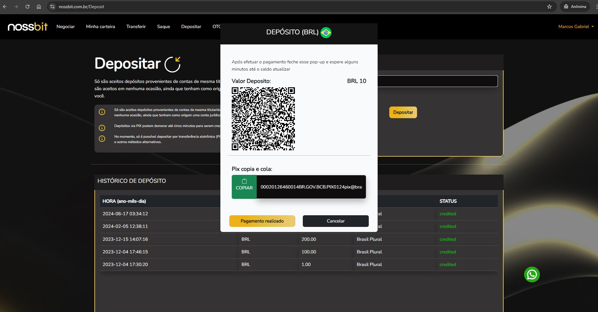

## Página Transferir

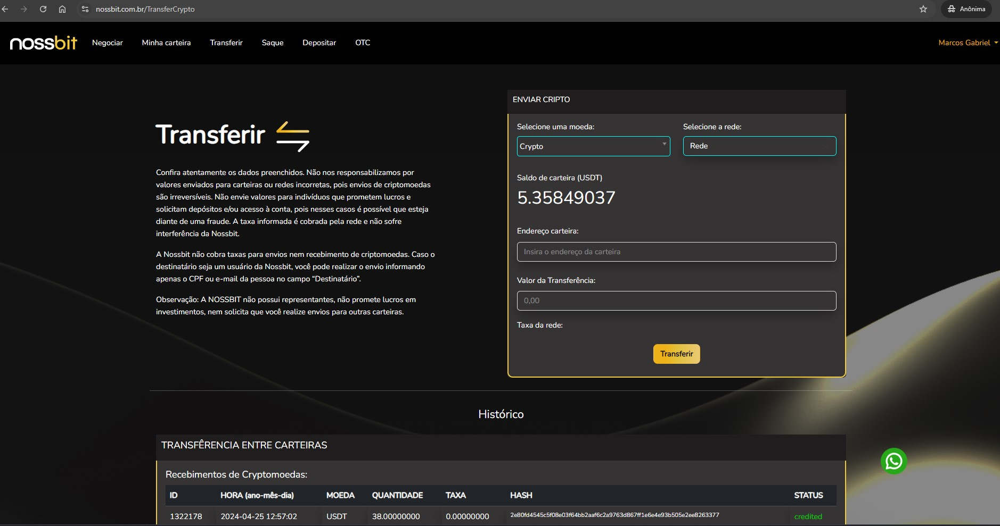

A **Página Transferir** é destinada à transferência de criptomoedas para outras carteiras:

- **Realização de Transferências**: Os usuários inserem o valor a ser transferido, e o sistema exibe a taxa associada.
- **Confirmação de Transferência**: Na página de confirmação, é necessário inserir um código de segurança para completar a transação.

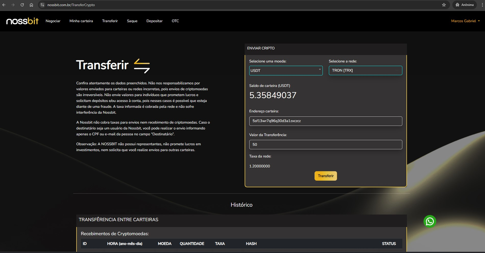

- **Histórico de Transferências**: Na parte inferior da página, todas as transferências realizadas são listadas, com informações obtidas via API.

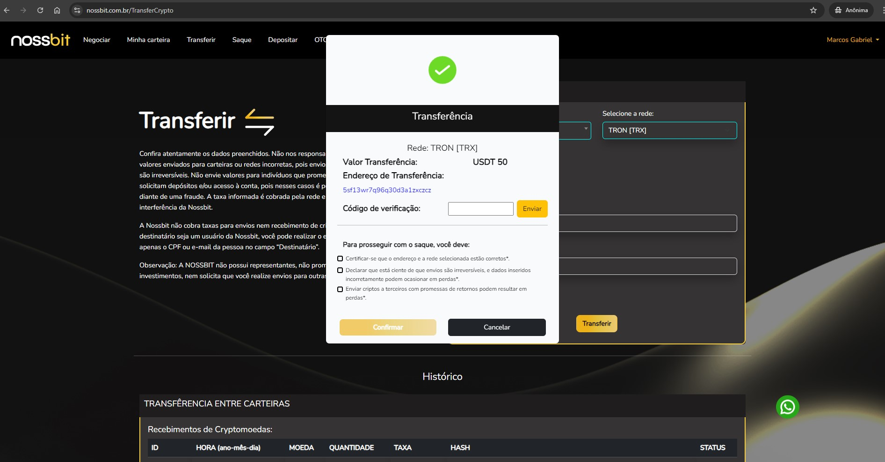

## Página OTC

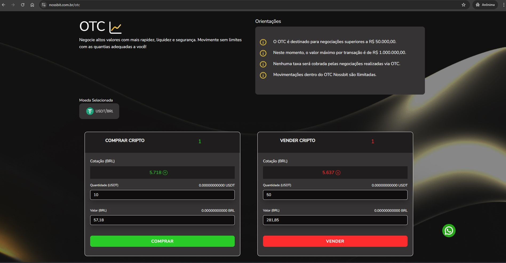

A **Página OTC** (Over-the-Counter) facilita a negociação de grandes volumes de criptomoedas:

- **Atualização de Cotações**: A cada 15 segundos, a página atualiza as cotações atuais das criptomoedas.
- **Cálculo Automático**: Ao inserir um valor, o sistema calcula automaticamente o montante que será pago.
- **Notificações e Confirmações**: Todas as compras finalizadas resultam no envio de um e-mail de confirmação, ativado via webhook.

## Ferramentas e Tecnologias Utilizadas

- **Laravel**: Utilizado como framework principal para o backend.
- **Blade**: O motor de templates do Laravel, usado para construir as interfaces de usuário de forma dinâmica e eficiente.
- **PHPUnit**: Usado para realizar testes.
- **LiveWire**: Usado para atualização automatica de cotação.
- **Queues (FIlas)** : Para disparo de e-mail e outras funções, evitando travamento da tela do usuário.
- **Bootstrap**: Framework de CSS.
- **Eloquent ORM**: O mapeamento objeto-relacional (ORM) do Laravel, utilizado para interagir com o banco de dados de maneira simplificada.
- **JavaScript e jQuery**: Utilizados para melhorar a interatividade do frontend.
- **API de Mercado Financeiro**: Implementada para obter as cotações atualizadas das criptomoedas em tempo real.
- **PHP QR Code**: Biblioteca para geração de QR Codes, facilitando pagamentos e transferências.
- **MySQL**: Banco de dados relacional utilizado para armazenar informações de usuários, transações e criptomoedas.
- **Webhooks**: Utilizados para notificações em tempo real, como confirmações de compras e outras transações.
